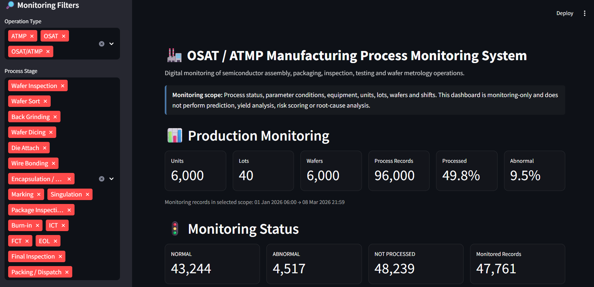
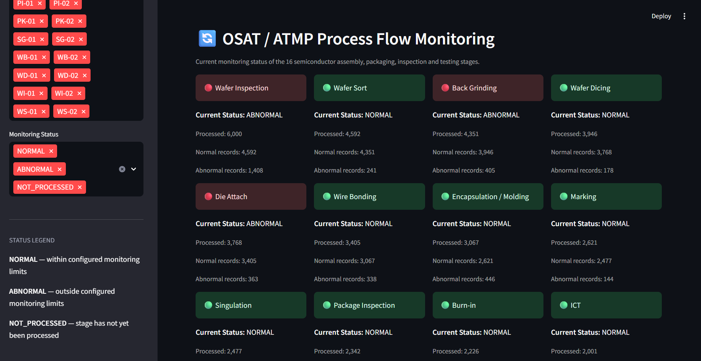
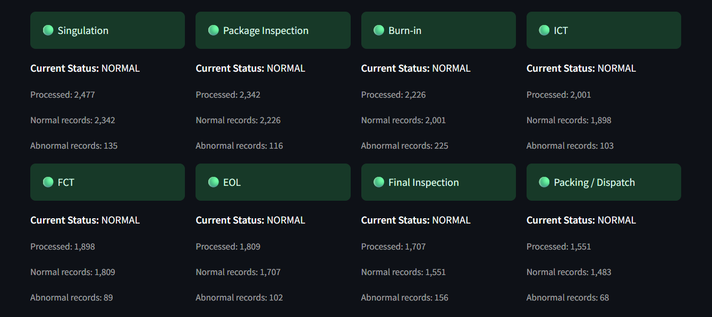
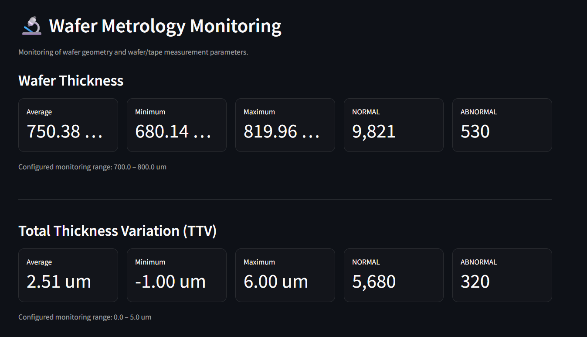
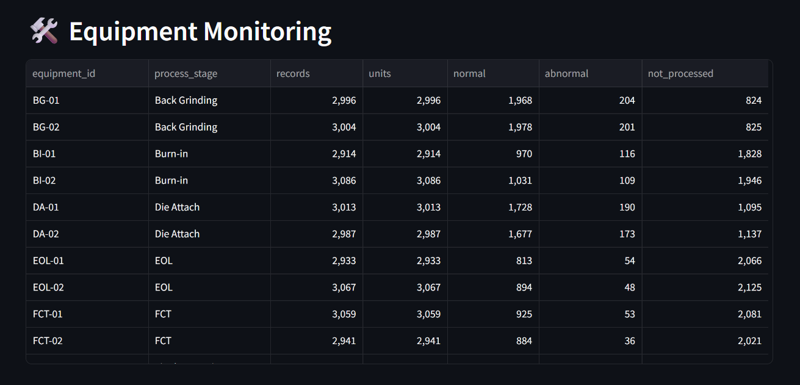
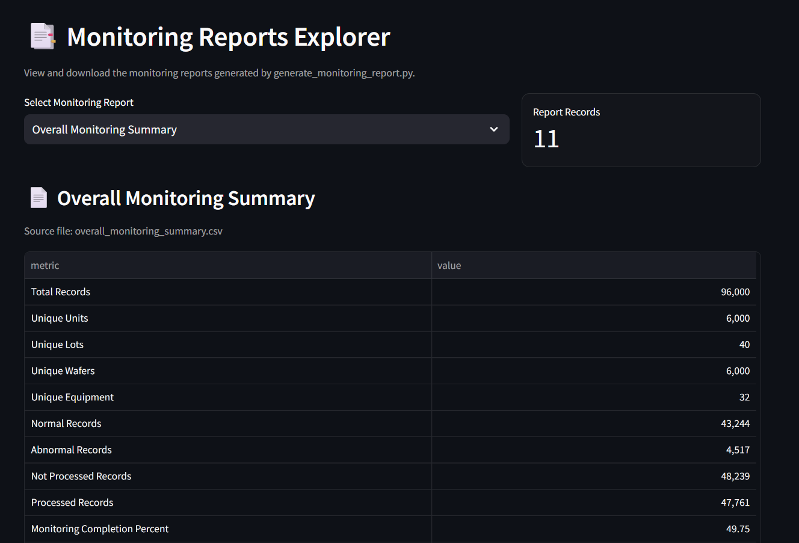

# OSAT / ATMP Manufacturing Process Monitoring System

A Python and Streamlit-based digital monitoring system for semiconductor assembly, packaging, inspection, testing, and wafer metrology operations.

> **Project scope:** Monitoring only. This project does not perform machine-learning prediction, yield analysis, risk scoring, root-cause analysis, or predictive analytics.

## 📌 Project Overview

The **OSAT / ATMP Manufacturing Process Monitoring System** provides a centralized dashboard for monitoring semiconductor manufacturing operations across multiple process stages.

The system tracks:

- Process-stage status
- Process parameters
- Wafer metrology
- Equipment
- Units, lots, and wafers
- Production shifts
- PASS / FAIL / NOT_PROCESSED status
- NORMAL / ABNORMAL / NOT_PROCESSED monitoring status
- Generated monitoring reports

The dashboard provides a visual view of the current process state and allows users to inspect and download monitoring reports.

## 🎯 Objective

The objective is to develop a digital manufacturing monitoring system that can organize and visualize process information across an OSAT / ATMP production flow.

The system is designed to demonstrate how manufacturing data can be structured, monitored against configured process limits, and presented through an operational dashboard.

## 🏭 OSAT / ATMP Process Flow

The project models 16 semiconductor manufacturing stages:

1. Wafer Inspection
2. Wafer Sort
3. Back Grinding
4. Wafer Dicing
5. Die Attach
6. Wire Bonding
7. Encapsulation / Molding
8. Marking
9. Singulation
10. Package Inspection
11. Burn-in
12. ICT
13. FCT
14. EOL
15. Final Inspection
16. Packing / Dispatch

## 🔍 Key Features

### Production Monitoring

The dashboard provides monitoring-level visibility of:

- 6,000 units
- 40 lots
- 6,000 wafers
- 96,000 process records
- Processed and not-processed records
- Normal and abnormal monitoring conditions

### Process Flow Monitoring

The 16-stage process flow is displayed as a visual monitoring interface.

Each stage shows:

- Current monitoring status
- Processed records
- Normal records
- Abnormal records

### Wafer Metrology Monitoring

The dashboard monitors wafer and tape measurement parameters including:

- Wafer thickness
- Total Thickness Variation (TTV)
- Bow
- Warp
- Tape thickness

Configured monitoring ranges are displayed alongside current measurements.

### Process Parameter Monitoring

The system provides parameter-level monitoring for manufacturing measurements such as:

- Sort current
- Thickness variation
- Kerf width
- Attach force
- Attach offset
- Wire bond force
- Bond pull strength
- Mold temperature
- Mold cure time
- Void percentage
- ICT current
- FCT voltage
- EOL temperature
- Packaging-related measurements

Parameters are classified as **NORMAL** or **ABNORMAL** according to the configured monitoring limits.

### Equipment Monitoring

Equipment-level monitoring includes equipment identifiers, associated process stages, records, units, normal conditions, abnormal conditions, and not-processed records.

### Shift Monitoring

Production monitoring is organized across:

- Shift A
- Shift B
- Shift C

### Abnormal Conditions

The dashboard provides a dedicated view of abnormal monitoring conditions, including timestamp, unit, lot, wafer, process stage, operation type, equipment, shift, and abnormal parameter information.

### Monitoring Reports Explorer

Generated CSV reports can be inspected and downloaded directly from the dashboard.

Reports include:

- Overall Monitoring Summary
- Stage Monitoring
- Parameter Monitoring
- Equipment Monitoring
- Shift Monitoring
- OSAT / ATMP Operation Monitoring
- Abnormal Conditions
- Unit Monitoring
- Lot Monitoring

## 📊 Dashboard Screenshots

### Dashboard Overview



### OSAT / ATMP Operation Classification



### Process Flow Monitoring



### Wafer and Process Parameter Monitoring



### Equipment and Abnormal Condition Monitoring



### Monitoring Reports Explorer



## 🧩 Project Architecture

```text
OSAT-ATMP-Manufacturing-Process-Monitoring
│
├── config/
│   ├── process_classification.csv
│   └── process_limits.csv
│
├── data/
│   └── osat_atmp_process_data.csv
│
├── outputs/
│   └── monitoring_reports/
│       ├── process_monitoring_results.csv
│       ├── stage_monitoring_report.csv
│       ├── parameter_monitoring_report.csv
│       ├── equipment_monitoring_report.csv
│       ├── shift_monitoring_report.csv
│       ├── operation_monitoring_report.csv
│       ├── abnormal_conditions_report.csv
│       ├── unit_monitoring_report.csv
│       ├── lot_monitoring_report.csv
│       └── overall_monitoring_summary.csv
│
├── screenshots/
│   ├── dashboard_overview.png
│   ├── operation_classification.png
│   ├── process_flow_monitoring.png
│   ├── parameter_monitoring.png
│   ├── equipment_abnormal_monitoring.png
│   └── monitoring_reports.png
│
├── src/
│   ├── dashboard.py
│   ├── generate_monitoring_report.py
│   ├── generate_process_data.py
│   └── monitoring_engine.py
│
├── .gitignore
├── README.md
└── requirements.txt
```

## ⚙️ Technology Stack

- **Python 3.8+**
- **Pandas** — data processing
- **NumPy** — numerical operations
- **Streamlit** — interactive dashboard
- **CSV** — process, configuration, and monitoring data
- **Git / GitHub** — version control and project sharing

## 🚀 How to Run

### 1. Clone the repository

```bash
git clone https://github.com/bedabrat18/OSAT-ATMP-Manufacturing-Process-Monitoring.git
cd OSAT-ATMP-Manufacturing-Process-Monitoring
```

### 2. Install dependencies

```bash
pip install -r requirements.txt
```

### 3. Run the dashboard

```bash
streamlit run src/dashboard.py
```

The Streamlit dashboard will open locally in your browser.

## 🔄 Data and Monitoring Workflow

```text
Synthetic Process Data
        │
        ▼
Process Classification
        │
        ▼
Configured Process Limits
        │
        ▼
Monitoring Engine
        │
        ├── Process Status
        ├── Parameter Status
        ├── Equipment Monitoring
        ├── Unit / Lot / Wafer Monitoring
        └── Shift Monitoring
        │
        ▼
Monitoring Reports
        │
        ▼
Streamlit Dashboard
```

## 📁 Main Python Modules

### `generate_process_data.py`

Generates the synthetic OSAT / ATMP process-monitoring dataset used by the project.

### `monitoring_engine.py`

Applies configured monitoring limits and creates monitoring results.

### `generate_monitoring_report.py`

Generates structured CSV monitoring reports for stages, parameters, equipment, shifts, units, lots, abnormal conditions, and overall monitoring.

### `dashboard.py`

Loads the monitoring results and reports and provides the interactive Streamlit dashboard.

## 📦 Dataset

The project uses a **synthetic manufacturing-monitoring dataset created for demonstration and portfolio purposes**.

The dataset represents:

- Units
- Lots
- Wafers
- Packages
- Process stages
- Operation types
- Equipment
- Shifts
- Process status
- Parameter measurements
- Monitoring status

The configured process limits are project demonstration values and **are not actual production specifications**.

## 📈 Monitoring Status Definitions

| Status | Meaning |
|---|---|
| `NORMAL` | Measurement is within the configured monitoring range |
| `ABNORMAL` | Measurement is outside the configured monitoring range |
| `NOT_PROCESSED` | The stage has not yet been processed |

## 🛠️ Possible Future Enhancements

The current project intentionally focuses on monitoring. Possible future extensions could include:

- Live manufacturing-system integration
- Database-backed process records
- Role-based dashboard access
- Real-time equipment data ingestion
- Historical trend visualization
- Automated alerts and notifications
- Integration with MES / SCADA systems
- Deployment on a cloud platform

These are potential future enhancements and are not implemented in the current version.

## ⚠️ Scope and Data Disclaimer

This is a **portfolio / demonstration project** using synthetic manufacturing-monitoring data.

The process limits shown in the dashboard are configured demonstration values and should not be interpreted as semiconductor manufacturing specifications.

The project is focused on **OSAT / ATMP manufacturing process monitoring** and intentionally does not implement machine-learning prediction, yield prediction, risk scoring, or root-cause analysis.

## 👨‍💻 Project Author

**Bedabrat Bharali**

B.Tech — Electronics & Instrumentation  
---

⭐ If you find this project useful, feel free to explore the source code and dashboard implementation.
